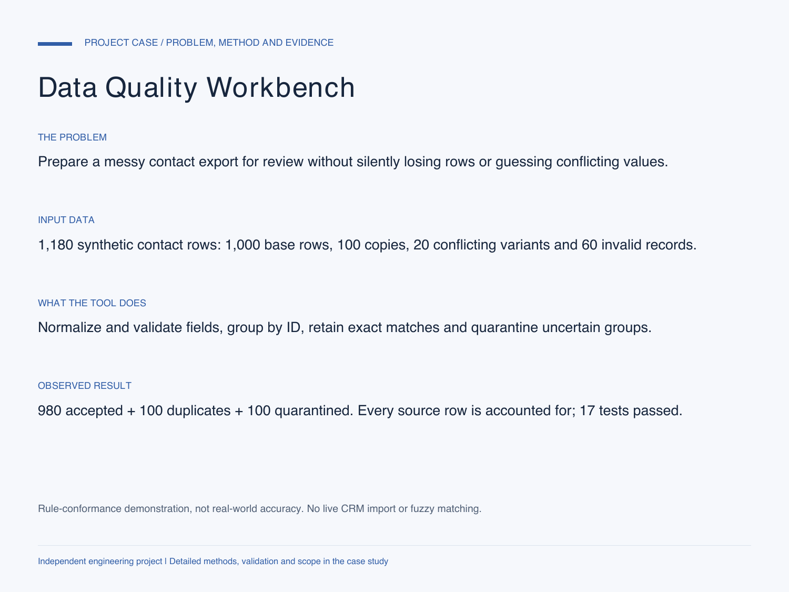

# Data Quality Workbench

An inspectable Python pipeline for cleaning CRM-style exports without silently guessing missing values or merging conflicting records.

[Detailed case study: problem, data, method, evidence and limits](CASE_STUDY.md)

**Independent engineering demonstration using synthetic contact records. Not a production CRM deployment.**

## What it delivers

- A normalized, duplicate-free CSV ready for a separately approved import.
- A complete source-row ledger: accepted, duplicate, or quarantined, with reasons.
- JSON evidence retaining original and normalized values plus the input SHA-256.
- A standalone HTML report with an outcome filter.
- A downloadable Excel review snapshot in `sample_review.xlsx`.

## Reproduce

Requires Python 3.10 or newer. The processing pipeline has no third-party dependencies.

    python -m unittest -v
    python demo.py --output demo-output
    python data_quality.py your_export.csv --output new-run

Use a new output directory for each run. Existing output directories are rejected.

Open `demo-output/results/report.html` in a browser. The six input columns are `record_id`, `name`, `email`, `country`, `joined_on`, and `plan`; see `demo.py` for the exact fixture generator and policy.

## Verified fixture result

| Outcome | Rows |
| --- | ---: |
| Input | 1,180 |
| Accepted | 980 |
| Normalized duplicates removed | 100 |
| Quarantined for review | 100 |
| Unaccounted rows | 0 |

The 100 quarantined rows include both sides of 20 conflicting IDs plus 60 invalid records. Every input row has exactly one disposition. Seventeen automated tests cover normalization, duplicate/conflict handling, missing/invalid fields, input preservation, stable reprocessing, CSV formula-prefix neutralization, HTML escaping, header validation and no-overwrite behavior.

## Policy and limits

- IDs follow the demo's C00001 convention; client ID rules must be configured explicitly.
- Country normalization uses an explicit US/GB/CN/AE map. Unknown countries are held for review, not guessed.
- ISO dates only. Email syntax is checked; mailbox ownership and deliverability are not.
- The documented policy treats email addresses case-insensitively.
- Conflicting IDs and groups containing an invalid record are quarantined. There is no fuzzy matching, external enrichment, or live CRM write.
- JSON preserves original values. Human-facing CSV neutralizes formula-like prefixes; spreadsheet import behavior should still be checked in the target application.
- `sample_review.xlsx` is a prebuilt snapshot with formula-linked counts and a source-row ledger. Its formulas were checked for recalculation in the authoring engine, not through a native Excel/VBA session. The portable Python CLI produces CSV, JSON and HTML, not XLSX.

## Project notes

See `verification.json` for the recorded test methods, runtime and source-file hashes. Passing these checks is conformance to the synthetic fixture, not an accuracy estimate for real customer data.

The source, fixtures and explicit acceptance checks document the demonstrated capability. No client identities, confidential datasets, API keys or customer outcomes are included.
